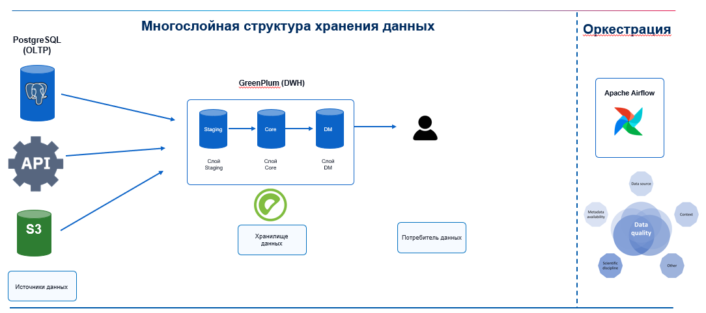

# Distributed Data Platform

**Авторы:**

- Мазориев У.А.
- Мещеряков Н.М.
- Шадрухин А.С.

Проект представляет собой универсальную распределенную платформу для сбора, хранения, проверки и обработки данных из нескольких источников. Платформа не привязана к конкретной предметной области и может быть адаптирована для работы с транзакционными, справочными, событийными и файловыми данными.

Центральным хранилищем выступает Greenplum. В нем реализуются слои Staging, Core и DM, выполняются преобразования и формируются аналитические витрины. Готовые наборы могут передаваться различным потребителям данных: аналитическим СУБД, вычислительным платформам, приложениям и другим сервисам. Apache Airflow управляет ETL/ELT-конвейером, а проверки Data Quality контролируют полноту, уникальность, целостность и корректность данных.

## Цель проекта

Цель проекта - разработать воспроизводимую распределенную платформу данных, обеспечивающую:

- загрузку данных из реляционных, файловых и внешних источников;
- централизованное хранение и обработку данных в Greenplum;
- разделение хранилища на слои Staging, Core и DM;
- автоматическое выполнение ETL/ELT-процессов;
- контроль качества данных на ключевых этапах;
- распределение данных и параллельную обработку запросов;
- демонстрацию зеркалирования сегментов Greenplum;
- передачу готовых витрин выбранному потребителю данных.

## Архитектура

```text
PostgreSQL / другие БД --------------------+
                                           |
API / внешние системы -> MinIO (S3) -------+--> Greenplum
Файлы CSV / Parquet -> MinIO (S3) ---------+    |-- Staging
                                                |-- Core
                                                `-- DM
                                                     |
                                                     v
                                           Потребитель данных

                 Apache Airflow + Data Quality
```



На схеме показано, как данные из операционных баз, API и S3-совместимого файлового хранилища поступают в Greenplum, проходят слои Staging, Core и DM, а затем передаются потребителю данных. Apache Airflow оркестрирует процессы, а Data Quality обеспечивает контроль данных на каждом этапе.

Данные из доступных реляционных источников могут загружаться непосредственно в Greenplum. MinIO используется для файлов, выгрузок внешних систем и данных, полученных через API. Такой подход не делает объектное хранилище обязательным промежуточным звеном для каждого источника.

## Технологический стек

| Компонент | Назначение |
|---|---|
| PostgreSQL | Пример операционного источника данных |
| MinIO | S3-совместимое хранение файлов и внешних выгрузок |
| Greenplum | Центральное распределенное хранилище данных |
| Apache Airflow | Оркестрация ETL/ELT-процессов |
| Потребитель данных | Получение подготовленных витрин для последующей обработки или анализа |
| Python | Получение, преобразование и проверка данных |
| SQL | Создание структур и преобразование данных |
| Docker Compose | Локальное развертывание компонентов |

## Слои хранилища

### Staging

Слой первичной загрузки сохраняет данные в структуре, близкой к источнику. Он используется для технической приемки, повторной обработки и фиксации метаданных загрузки.

### Core

Core содержит очищенные, согласованные и историзированные данные. Здесь выполняются приведение типов, дедупликация, контроль бизнес-ключей, проверка ссылочной целостности и объединение данных из разных источников.

### DM

Слой DM содержит готовые предметные витрины. Они строятся на основе Core и оптимизируются под конкретные сценарии анализа или потребления. После проверки витрины передаются выбранному потребителю данных.

## Data Quality

Проверки качества встроены в ETL/ELT-конвейер и выполняются после загрузки в Staging, перед публикацией в Core, после формирования DM и после передачи данных потребителю.

| Категория | Пример проверки |
|---|---|
| Полнота | Обязательные поля не содержат `NULL` |
| Уникальность | Бизнес-ключи и идентификаторы не дублируются |
| Целостность | Ссылки на связанные сущности корректны |
| Допустимость | Значения входят в разрешенный перечень |
| Диапазон | Числовые показатели находятся в допустимых границах |
| Актуальность | Загружен ожидаемый временной срез |
| Сверка | Количество строк и контрольные суммы совпадают между слоями |
| Распределение | В Greenplum отсутствует критический перекос данных |

Результаты проверок планируется сохранять в технических таблицах:

```text
dq.check_results
dq.rejected_records
dq.pipeline_runs
```

Критическая ошибка должна останавливать публикацию данных. Некритическое отклонение фиксируется как предупреждение.

## Распределение данных в Greenplum

Greenplum использует MPP-архитектуру и распределяет строки между сегментами. Это позволяет выполнять части аналитического запроса параллельно.

Для крупных таблиц используется распределение по ключу:

```sql
DISTRIBUTED BY (entity_id);
```

Для небольших справочников может применяться размещение копии на каждом сегменте:

```sql
DISTRIBUTED REPLICATED;
```

Ключ распределения выбирается с учетом кардинальности, равномерности значений и частоты использования поля в операциях соединения. В проекте планируется сравнить несколько стратегий и проверить наличие data skew.

## Зеркалирование сегментов

Для демонстрации отказоустойчивости в Greenplum используются primary- и mirror-сегменты. В проекте планируется показать имитацию отказа основного сегмента, переключение на зеркало и восстановление штатной конфигурации.

Зеркалирование повышает доступность кластера, но не заменяет резервное копирование.

## Потребители данных

Потребитель данных не является центральным DWH и не содержит основную бизнес-логику преобразований. Ему передаются уже сформированные и проверенные витрины Greenplum DM.

В качестве потребителя могут использоваться:

- аналитическая СУБД;
- Apache Spark или другая вычислительная платформа;
- прикладной сервис;
- система машинного обучения;
- инструмент исследования данных;
- внешний контур обмена данными.

Перед публикацией выполняются:

1. Проверка успешного формирования витрины в Greenplum.
2. Контроль обязательных полей и уникальности ключей.
3. Очистка или замена целевого среза у потребителя, если это требуется выбранной технологией.
4. Загрузка подготовленных данных.
5. Сверка количества строк и контрольных показателей.

## Оркестрация

Apache Airflow управляет зависимостями, расписанием, повторными запусками и контролем состояния процессов.

Планируемые DAG-процессы:

| DAG | Назначение |
|---|---|
| `load_database_sources` | Загрузка данных из реляционных источников в Greenplum Staging |
| `load_external_sources` | Получение API- и файловых данных и сохранение в MinIO |
| `load_minio_to_staging` | Загрузка файлов из MinIO в Greenplum |
| `staging_data_quality` | Входной контроль данных Staging |
| `staging_to_core` | Очистка и перенос данных в Core |
| `core_data_quality` | Проверка согласованности Core |
| `core_to_dm` | Формирование аналитических витрин |
| `dm_data_quality` | Контроль готовых витрин |
| `publish_data_marts` | Передача витрин потребителю и итоговая сверка |

## Этапы реализации

### Этап 1. Подготовка инфраструктуры и источников

- развернуть PostgreSQL, MinIO, Airflow и Greenplum;
- подготовить тестовые источники разных типов;
- настроить подключения и первичную загрузку.

### Этап 2. Создание DWH в Greenplum

- создать схемы Staging, Core и DM;
- подготовить DDL-скрипты;
- реализовать преобразования между слоями;
- обеспечить повторяемость загрузок.

### Этап 3. Внедрение Data Quality

- создать технические таблицы контроля;
- реализовать проверки полноты, уникальности и целостности;
- настроить обработку отклоненных записей;
- связать проверки с запусками Airflow.

### Этап 4. Распределение и параллельная обработка

- развернуть несколько сегментов Greenplum;
- подобрать ключи распределения;
- проанализировать равномерность размещения строк;
- сравнить планы и время выполнения запросов.

### Этап 5. Отказоустойчивость и публикация витрин

- настроить mirror-сегменты;
- продемонстрировать переключение при отказе;
- сформировать витрины DM;
- передать витрины выбранному потребителю данных;
- выполнить итоговую сверку данных.

## Планируемая структура репозитория

```text
greenplum-data-platform/
|-- airflow/
|   `-- dags/
|-- docker/
|   |-- airflow/
|   |-- consumers/
|   |-- greenplum/
|   `-- minio/
|-- sql/
|   |-- source/
|   |-- staging/
|   |-- core/
|   |-- dm/
|   |-- data_quality/
|   |-- distribution/
|   `-- consumers/
|-- tests/
|   |-- data_quality/
|   |-- integration/
|   `-- performance/
|-- docs/
|-- .env.example
|-- docker-compose.yml
`-- README.md
```

## Проверка результата

Проверка проекта должна включать:

- доступность всех сервисов;
- успешное выполнение DAG-процессов;
- наличие данных в Staging, Core и DM;
- отсутствие дублей и нарушений целостности;
- совпадение количества строк между слоями;
- анализ распределения строк по сегментам;
- сравнение времени выполнения запросов;
- переключение на mirror-сегмент;
- совпадение данных в Greenplum DM и целевой системе-потребителе.

Пример проверки распределения строк:

```sql
SELECT gp_segment_id, COUNT(*)
FROM core.example_fact
GROUP BY gp_segment_id
ORDER BY gp_segment_id;
```

## Практическая ценность

Проект объединяет проектирование DWH, работу с распределенной СУБД, оркестрацию, контроль качества и публикацию витрин внешнему аналитическому потребителю.

Платформа демонстрирует полный инженерный процесс:

```text
источники -> загрузка -> Staging -> Data Quality -> Core -> DM -> потребитель данных
```

Архитектура не зависит от конкретной предметной области. Для адаптации проекта достаточно заменить модели источников, правила преобразования, проверки качества и состав витрин.

## Ограничения демонстрационной реализации

Проект предназначен для локальной демонстрации архитектурных принципов. Количество сегментов и объем данных будут меньше, чем в промышленном кластере.

Для промышленной эксплуатации дополнительно потребуются централизованный мониторинг, резервное копирование, управление секретами, разграничение доступа, шифрование соединений и отдельные узлы кластера.

## Статус проекта

Проект находится на стадии последовательной реализации. Итоговым результатом должен стать воспроизводимый локальный стенд распределенной платформы данных без привязки к конкретной предметной области.
